  <picture>
    <source media="(prefers-color-scheme: light)" srcset="assets/hero-light.svg" />
    
  </picture>

  <a href="https://www.linkedin.com/in/shubhamk9/"><b>LinkedIn</b></a>
  &nbsp;·&nbsp;
  <a href="mailto:shubhamkuya@gmail.com">Email</a>
  &nbsp;·&nbsp;
  <a href="https://github.com/shubham0915?tab=repositories">Projects</a>

  

## Building intelligent systems through data and machine learning

I am a Data Science and Machine Learning enthusiast with hands-on experience in building Agentic RAG systems, predictive analytics pipelines, and scalable Big Data solutions. My work focuses on extracting actionable insights from complex datasets and deploying robust AI applications utilizing technologies like Apache Spark and Kafka.

  <picture>
    <source media="(prefers-color-scheme: light)" srcset="assets/about-light.svg" />
    
  </picture>

## Selected work

  

| Project | What it is |
| --- | --- |
| **Enterprise Agentic RAG System** | Enterprise-grade Agentic RAG system parsing complex document formats with Gemini embeddings, LangGraph, FastAPI, and NeMo Guardrails. |
| **Privacy-Safe Ad Recommendation Engine** | Scalable data pipeline and backend API using DuckDB clean room, Differential Privacy, FastAPI, and Redis for real-time personalized ads. |
| **SuperStore Analytics Hub** | Unified KPI and dashboard hub for faster business reporting using Streamlit, Power BI, and Plotly. |
| **Hotel Reviews Sentiment Analysis** | Multi-model NLP (VADER, RoBERTa, BERT) for structured guest sentiment into a comparison-ready reporting flow. |
| **Student Exam Score Prediction** | Machine learning system predicting student exam scores from behavioral lifestyle features using Scikit-Learn and a Streamlit dashboard. |
| **Movie Success Analysis** | Exploratory data analysis (EDA) to surface signals tied to movie performance using Pandas and Jupyter Notebooks. |
| **LaptopAnalysis** | Reusable notebook for fast model-to-model and price-to-spec laptop comparison using Python and Data Visualization. |

  <a href="https://github.com/shubham0915"><b>Explore more on GitHub</b></a>

## Engineering signal

  

  

## A profile that moves

The contribution graph is part of the profile experience. It refreshes automatically from this repository and turns public activity into a small visual system.

  

## Current focus

  <picture>
    <source media="(prefers-color-scheme: light)" srcset="assets/highlights-light.svg" />
    
  </picture>

  <a href="https://github.com/shubham0915?tab=repositories">See all repositories</a>
  &nbsp;·&nbsp;
  <a href="https://www.gitskins.com/readme-generator">Build a profile like this</a>

  Designed with GitSkins.

